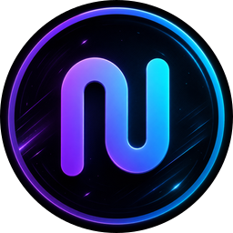

  <a href="README.md"> English</a>

# نوا کلاینت (Nova Client)

**کلاینت اختصاصی نوا — نسخه بهینه‌سازی‌شده و بازطراحی‌شده از [Karing](https://github.com/KaringX/karing) — به همراه اسکنر آی‌پی تمیز کلودفلر [رادار نوا](https://github.com/IRNova/NovaRadar) به صورت بومی و داخلی.**

ساخته شده با فلاتر · کاملاً تاریک (Dark-first) · دو زبانه (انگلیسی + فارسی) · پیروی از هویت بصری [پروکسی نوا](https://github.com/IRNova/Nova-Proxy).

**طراحی و توسعه توسط [وحید هاشمی](https://github.com/iiviirv)**

---

## 🌐 لینک‌های ارتباطی

---

## 📥 مرکز دانلود کلاینت نوا

پلتفرم خود را جهت دانلود آخرین نسخه از نوا کلاینت انتخاب کنید.

<table style="width: 100%; border-collapse: collapse; border: none; font-family: sans-serif;">
  <tr style="border: none;">
    <!-- Android Card -->
    <td align="center" style="width: 33%; border: 1px solid #1e293b; border-radius: 12px; padding: 20px; background: #05060a; color: #fff;">
       
      <h3 style="margin: 10px 0 5px 0; color: #22d3ee;">اندروید (Android)</h3>
      
v1.1.0-beta

       
       
      
    </td>
    <!-- iOS Card -->
    <td align="center" style="width: 33%; border: 1px solid #1e293b; border-radius: 12px; padding: 20px; background: #05060a; color: #fff;">
       
      <h3 style="margin: 10px 0 5px 0; color: #818cf8;">آیفون و آیپد (iOS)</h3>
      
تست‌فلایت (نسخه بتا)

       
       
      
    </td>
    <!-- Windows Card -->
    <td align="center" style="width: 33%; border: 1px solid #1e293b; border-radius: 12px; padding: 20px; background: #05060a; color: #fff;">
       
      <h3 style="margin: 10px 0 5px 0; color: #a855f7;">ویندوز (Windows)</h3>
      
v1.1.0-beta

       
       
      
    </td>
  </tr>
  <tr style="border: none;">
    <!-- macOS Card -->
    <td align="center" style="width: 33%; border: 1px solid #1e293b; border-radius: 12px; padding: 20px; background: #05060a; color: #fff;">
       
      <h3 style="margin: 10px 0 5px 0; color: #22d3ee;">مک (macOS)</h3>
      
v1.1.0-beta

       
       
      
    </td>
    <!-- Linux Card -->
    <td align="center" style="width: 33%; border: 1px solid #1e293b; border-radius: 12px; padding: 20px; background: #05060a; color: #fff;">
       
      <h3 style="margin: 10px 0 5px 0; color: #a855f7;">لینوکس (Linux)</h3>
      
v1.1.0-beta

       
       
      
    </td>
    <!-- General releases Card -->
    <td align="center" style="width: 33%; border: 1px solid #1e293b; border-radius: 12px; padding: 20px; background: #05060a; color: #fff;">
       
      <h3 style="margin: 10px 0 5px 0; color: #0ea5e9;">تمام نسخه‌ها</h3>
      
آرشیو ریلیزهای گیت‌هاب

       
       
      
    </td>
  </tr>
</table>

---

## ✨ تازه‌های نسخه v1.1.0-beta

پروکسی حالا روی **تمام پلتفرم‌ها** (اندروید، iOS، ویندوز و مک) فعال است و تجربه‌ی لیست سرورها به‌طور کامل ارتقا یافته است:

- 🌍 **لیست کامل سرورها**: هر سرور کشور و شهر، پروتکل (VLESS / VMess / Trojan / Shadowsocks / Hysteria2 / TUIC)، نوع انتقال (WS / gRPC و TLS / Reality)، اثرانگشت TLS و SNI، و تأخیر زنده بر حسب میلی‌ثانیه را نمایش می‌دهد.
- 🔎 **جستجوی سرورها**: فیلتر کردن سرورها بر اساس نام، کشور، پروتکل، آدرس یا SNI.
- ⚡ **حالت خودکار (سریع‌ترین)**: نوا کم‌تأخیرترین سرور فعال را برایتان انتخاب می‌کند و اگر سروری قطع شود، به‌صورت خودکار به سرور بعدی سوییچ می‌کند.
- 🆓 **همیشه رایگان، بدون فروش مجدد**: یک بنر واضح با پیام «نوا رایگان است، برای این کانفیگ‌ها به کسی پول ندهید»، به‌همراه دکمه‌های **دنبال کردن نوا** (تلگرام، اینستاگرام، گیت‌هاب و وب‌سایت) تا همیشه به جامعه‌ی رسمی نوا دسترسی داشته باشید.
- 🇮🇷 **مسیریابی هوشمند برای ایران**: سایت‌های ایرانی (دامنه‌های `.ir`) با آی‌پی واقعی شما به‌صورت مستقیم باز می‌شوند تا همیشه سریع بارگذاری شوند، حتی وقتی لیست قوانین دانلود نشود. مسدودسازی تبلیغات و بایپس شبکه‌ی محلی (LAN) هم به‌صورت اختیاری در دسترس است.
- 🌐 **دو زبانه در همه‌جا**: کل برنامه، از جمله همین صفحات جدید، به انگلیسی و فارسی (راست‌چین).

---

### 📖 معرفی برنامه
نوا کلاینت (Nova Client) دو ابزار قدرتمند پروژه نوا را در قالب یک نرم‌افزار چندسکویی یکپارچه می‌کند:
۱. **یک کلاینت پروکسی** با الهام از هسته و ساختار کاری کلاینت محبوب Karing (رابط گرافیکی sing-box) — جهت اتصال، مدیریت پروفایل‌ها و اشتراک‌ها و کنترل هوشمند مسیریابی که کاملاً بازطراحی شده و با هویت بصری مدرن نوا پروکسی هماهنگ شده است.
۲. **رادار نوا (Nova Radar)** — اسکنر پیشرفته یافتن آی‌پی‌های تمیز کلودفلر (که پیش از این به زبان Go و Wails برای دسکتاپ توسعه داده شده بود) که به زبان Dart پورت شده و به عنوان یک زبانه (Tab) مستقل و تراز اول در برنامه ادغام شده است.

از نسخه‌ی **v1.1.0-beta** مسیر تبادل داده‌ی پروکسی فعال است: هسته‌ی sing-box روی هر چهار پلتفرم متصل می‌شود و پارس اشتراک‌ها، تأخیر هر سرور، مسیریابی هوشمند و اسکنر رادار نوا همگی کار می‌کنند.

### 📊 وضعیت کنونی پروژه در یک نگاه

| بخش | وضعیت | توضیحات |
|------|:---:|-------|
| سیستم طراحی نوا | ✅ | پورت شده به صورت ۱:۱ از `tokens.css` (رنگ‌ها، گرادینت، فونت‌ها) |
| نشان تجاری و برندینگ | ✅ | طراحی بومی و مدرن لوگوی نئونی "N" و گرادینت از SVG رسمی |
| پوسته و ناوبری واکنش‌گرا | ✅ | منوی کناری (بخش دسکتاپ/تبلت) و نوار پایینی (بخش موبایل) |
| رابط کاربری دو زبانه | ✅ | پشتیبانی کامل از زبان‌های انگلیسی و فارسی (راست‌چین RTL) |
| داشبورد اصلی | ✅ | طراحی جذاب اورب اتصال، نمایش زنده ترافیک و پروفایل فعال |
| مدیریت پروفایل‌ها و اشتراک‌ها | ✅ | افزودن، انتخاب و ذخیره دائمی اشتراک‌ها |
| کنترل‌های مسیریابی | ✅ | تغییر حالت‌های مسیریابی، قوانین ترافیک و مسیر مستقیم `.ir` |
| لیست سرورها | ✅ | تأخیر هر سرور، کشور/شهر، پروتکل، نوع انتقال، SNI و جستجو |
| **اسکنر بومی رادار نوا** | ✅ | **کاملاً فعال** (دریافت منابع ← تولید IP ← بررسی دو مرحله‌ای TCP+TLS ← مرتب‌سازی تأخیر ← خروجی) |
| هسته sing-box | ✅ | فعال روی اندروید · iOS · ویندوز · مک |

### 🎨 زبان طراحی (هویت بصری)
تمام بخش‌های رابط کاربری بر اساس توکن‌های طراحی اختصاصی نوا پروکسی که مستقیماً پورت شده‌اند پیاده‌سازی شده است:
- **گرادینت امضا:** `linear-gradient(120deg, #22d3ee → #818cf8 → #a855f7)` استفاده شده در دکمه‌ها، لوگو، متون گرادینت، نوارهای پیشرفت و اورب اتصال.
- **تاریک‌محور (Dark-first):** استفاده از پس‌زمینه عمیق `#05060a`، کارت‌های شیشه‌ای و نیمه‌شفاف با خطوط مرزی بسیار باریک و ظریف (با قابلیت فعال‌سازی تم روشن).
- **رنگ‌های مکمل:** فیروزه‌ای `#22d3ee` / بنفش `#a855f7` / نیلگون `#818cf8`.
- **طراحی زوایا (Radii):** لبه‌های ۱۶ پیکسل برای کارت‌ها، ۱۰ پیکسل برای فیلدهای ورودی و دکمه‌های کپسولی به همراه سایه نئونی درخشان.
- **تایپوگرافی:** استفاده از فونت مدرن Inter برای زبان انگلیسی و فونت زیبای **وزیرمتن (Vazirmatn)** برای زبان فارسی.

### 🛰️ رادار نوا — فرآیند پورت شده
هسته بک‌اند که در گذشته با زبان Go توسعه یافته بود، به طور کامل بازنویسی شده و با استفاده از سوکت‌های بومی Dart (`dart:io`) پیاده‌سازی شده است که تمام الگوریتم‌های نسخه اصلی را حفظ می‌کند:
۱. دریافت موازی **منابع آی‌پی فعال** (۹ منبع معتبر از جمله آی‌پی‌های رسمی کلودفلر، رنج‌های ASN، لیست CM، آی‌پی‌های ریورس‌پروکسی و دامنه‌های تحلیل‌شده) به همراه رنج‌های بومی داخلی به عنوان پشتیبان.
۲. تولید حداکثر ۵۱۲ آی‌پی تصادفی توزیع شده در رنج‌های CIDR.
۳. **فاز اول — اسکن سریع:** برقراری اتصال موازی TCP به هر IP و پورت مشخص شده.
۴. **فاز دوم — اسکن عمیق:** انجام دست‌دهی واقعی TLS (به همراه SNI اختصاصی ورکر نوا) بر روی پورت‌های امن، یا بررسی پروپ TCP روی پورت‌های HTTP (سه مرتبه تکرار برای هر کاندیدا و نگه‌داری آی‌پی‌هایی با نرخ موفقیت حداقل ۲ از ۳).
۵. مرتب‌سازی آی‌پی‌ها بر اساس کمترین تأخیر، نمایش زنده پیشرفت اسکن و خروجی نهایی با فرمت استاندارد `ip:port#Nova-XXXXX`.

### 🗺️ نقشه راه آینده (Roadmap)
- [x] ادغام هسته sing-box به همراه پیاده‌سازی سرویس بومی VPN برای هر پلتفرم پشت `SingboxProxyController`.
- [x] سیستم پارس و تحلیل هوشمند لینک‌های اشتراک و سنجش پینگ/سلامت سرورها.
- [x] امکان اعمال آی‌پی‌های تمیز رادار با یک کلیک روی پروفایل فعال.
- [ ] همگام‌سازی ابری اشتراک‌ها از طریق iCloud و WebDAV.

### 👥 توسعه‌دهندگان و حمایت
- [Karing](https://github.com/KaringX/karing) — هسته و رابط گرافیکی الهام‌بخش کلاینت نوا.
- [Nova Radar](https://github.com/IRNova/NovaRadar) — اسکنر قدرتمند ادغام شده.
- [Nova Proxy](https://github.com/IRNova/Nova-Proxy) و وب‌سایت [novaproxy.online](https://novaproxy.online) — طراحان زبان بصری و ایده اصلی پروژه.

اگر پروژه نوا برای شما مفید بوده است، با **⭐ دادن ستاره به ریپازیتوری** و حمایت مالی، به زنده نگه‌داشتن و رایگان ماندن این پروژه برای همه کمک کنید.

| ارز دیجیتال | آدرس کیف پول |
|------|---------|
| **TON** | `UQD51lGC35rP_SbVYgbFA7CEEii4GVMFgqj4N8fiGi6m425w` |

---

Made with ❤️ for a free and open internet.  
ساخته شده با عشق برای اینترنتی آزاد و در دسترس برای همگان.

---

طراحی و توسعه توسط <a href="https://github.com/iiviirv"><b>وحید هاشمی</b></a> (<a href="https://github.com/iiviirv">@iiviirv</a>) برای گروه نوا پروکسی.

